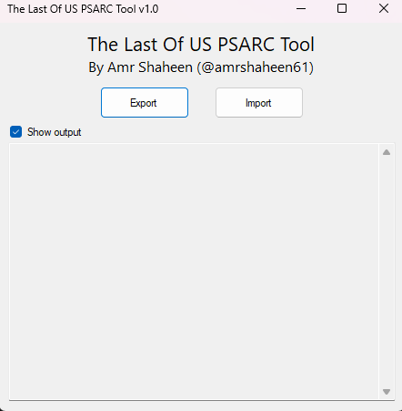

# 🎮 TLOU PSARC Tool 🧩

Unlock the power to **extract** and **repack** PSARC archives from *The Last of Us* with ease!  
A sleek, user-friendly **Windows EXE** app designed for fans, modders, and devs who want to dive deep into the game files — no coding required! 🚀✨

---

## 🚀 App Preview

---

## 🔥 Features

- 🎯 Simple GUI with **Import** & **Export** buttons — no command line needed!  
- 📂 Quickly **import** PSARC archives for extraction  
- 🗂️ Effortlessly **export** modified files back into PSARC format  
- ⚡ Lightning-fast processing  
- 🕹️ Full support for all PSARC versions used in *The Last of Us*  
- 💻 Lightweight & standalone `.exe` — just download and run!

---

## 💾 How to Use

1. **Download** the latest `TLOU_PSARC_Tool.exe`  
2. **Launch** the app by double-clicking the EXE  
3. Click **Import** to open a PSARC archive and extract its contents  
4. Modify your extracted files as needed  
5. Click **Export** to repack the folder back into a PSARC archive  
6. Done! Easy modding for your favorite game 🎉

---

## 📥 Download

Check the [Releases](https://github.com/yourusername/TLOU_PSARC_Tool/releases) page for the latest version!

---

## 🤝 Contributing

Want to improve the tool?  
Feel free to:

- 🐞 Report bugs  
- 💡 Suggest new features  
- 👨‍💻 Submit pull requests  

Please follow the contribution guidelines in the [CONTRIBUTING.md](CONTRIBUTING.md) file.

---

## 📝 License

This project is licensed under the **MIT License** — see the [LICENSE](LICENSE) file for details.

---

## 💬 Contact

Created with ❤️ by [Your Name](https://github.com/yourusername)  
Follow me on Twitter: [@yourhandle](https://twitter.com/yourhandle)

---

Thanks for using **TLOU PSARC Tool**!  
Happy modding and enjoy *The Last of Us*! 🎮✨
